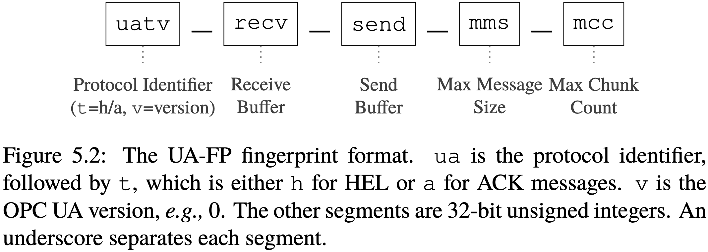

# OPC UA Rules
We have implemented detections for the following OPC UA implementations/libraries. The rules target the handshakes (`HEL`/`ACK` messages) that are sent when the client and server establishes a connection. The rules do not implement JA4X detections of default vendor certificates as Suricata does not currently support JA4X out of the box. 
- opcua-asyncio v1.2b2 (OPC UA Server/Client)
- python-opcua 0.98.13 (OPC UA Server)
- Prosys OPC UA Browser 2026.1.0-33 (OPC UA Client)
- Prosys OPC UA Simulation Server 2026.1.0-16 (OPC UA Server)
- Integration Objects UA Client v1.4.0 - Build 20190124 (OPC UA Client)
- ~~Integration Objects OPC UA Server Simulator (OPC UA Server)~~
- Kepware Server v7.0.236.0 (OPC UA Server)
- Matrikon OPC UA Explorer 2.5.0.712 (OPC UA Client)
- Softing OPC UA Client 2.50.0.804 (OPC UA Client)
- Softing dataFEED OPC UA Demo Server 1.46.07478 (OPC UA Server)

*Note: We were unable to establish connections with the Integration Objects server.*

## The UA-FP Format

## UA-FP to Suricata
A script for converting UA-FP fingerprints to Suricata rules is found [scripts/opcua-to-suricata/](scripts/opcua-to-suricata/). Run the script for usage instructions.

## Rules
We converted the UA-FP fingerprints into continous byte blocks in little-endian format, and validated the rules against our recorded traffic. There is no native OPC UA protocol keyword in Suricata, so we use the `content` keyword to match the `HEL`/`ACK` message fields in TCP packets.

Because `python-opcua` is the predecessor to `opcua-asyncio`, they have the same fingerprint, and we combine them into a single rule. Some implementations have multiple fingerprints (e.g., Kepware), and they are implemented as separate rules.

## JA4X Hashes
We compile a list of JA4X hashes of default certificates that come with the applications/libraries. This could be useful as a misconfiguration/default config detection mechanism. Default configurations make the host vulnerable to impersonation attacks.

| Application/Library | JA4X Hash | Type of Cert |
|-----------|-------------|---------|
| Prosys OPC UA Browser 2026.1.0-33 | 711618dec96d_711618dec96d_ae9901946d5e | Client |
| Prosys OPC UA Simulation Server 2026.1.0-16 | ae7a14fac82f_ae7a14fac82f_ae9901946d5e | Server |
| Integration Objects UA Client v1.4.0 - Build 20190124 | f1438bf8784a_f1438bf8784a_fac9b595f721 | Client |
| opcua-asyncio | ae7a14fac82f_ae7a14fac82f_1430e4a87223 | Client |
| opcua-asyncio | df1ecbee9743_df1ecbee9743_1ec555057754 | Server |
| Kepware Server v7.0.236.0 | 20a235741bae_20a235741bae_92a2d440f241 | Server |
| Softing OPC UA Client 2.50.0.804 | 7022c563de38_7022c563de38_81f0fa53bbe1 | Client |
| Softing dataFEED OPC UA Demo Server 1.46.07478 | f1438bf8784a_f1438bf8784a_fac9b595f721 | Server |
| Matrikon OPC UA Explorer 2.5.0.712 | f1438bf8784a_f1438bf8784a_fac9b595f721 | Client |
| python-opcua 0.98.13 | 9dd61cd121d9_9dd61cd121d9_044883b05ad5 | Server |
